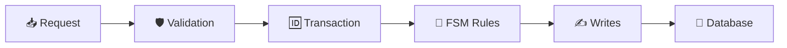

***
# 🔬 Clinical Research Study Tracker
### 🛡️ **Correctness is enforced, not assumed.**

This is a **constraint-driven system** engineered to manage clinical study enrollments with high-integrity guarantees. It treats data integrity not as a feature, but as a formal requirement.

The system enforces correctness through:
- 🧱 **Database Constraints** (The final authority)
- ⚛️ **Atomic Transactions** (All-or-nothing execution)
- 🚦 **FSM Enforcement** (Controlled workflow transitions)
- 🕒 **Deterministic Scheduling** (UTC normalization)
- 🙅 **Explicit Rejection** (Blocking invalid operations at the boundary)

---

## 🚀 Start Here: The 2-Minute Proof
*Do not start with the code. Observe the system under failure conditions.*

Follow this sequence to verify the system's integrity:

1. ✅ **Enrollment Success**  
   Execute a valid enrollment → Data is created correctly.
2. 🔄 **Atomic Rollback**  
   Force failure mid-transaction → **No partial writes occur.**
3. 🆔 **Duplicate Protection**  
   Re-submit the same participant → **409 Conflict (Idempotency enforced).**
4. 🚦 **FSM Enforcement**  
   Attempt an illegal status transition → **Request rejected by State Machine.**
5. 🧱 **Relational Integrity**  
   Attempt to delete a parent with children → **Blocked by DB Foreign Key.**

➡️ **Run the demo:** [`/docs/START_HERE/00_RUN_DEMO.md`](./docs/START_HERE/00_RUN_DEMO.md)

---

## 🏗️ Enforcement Path (Non-Bypassable)

All state changes must pass through a single, unidirectional gauntlet. **No state change can bypass this path.**



### Enforcement Responsibilities:
*   **Validation:** Rejects malformed input early.
*   **Transaction:** Ensures all-or-nothing execution.
*   **FSM:** Enforces lifecycle correctness (e.g., you cannot "Complete" a study that hasn't "Started").
*   **Database:** Enforces final integrity through hard constraints (FK/Unique).

---

## 💎 System Guarantees

Each guarantee is enforced by a concrete mechanism to eliminate a specific failure class.

| Guarantee | ⚙️ Mechanism | 🚫 Failure Prevented |
| :--- | :--- | :--- |
| **Atomic Transactions** | Single transaction boundary | Partial writes / Rollback corruption |
| **Duplicate Protection** | DB Unique Constraint + 409 Map | Duplicate state under concurrency |
| **Lifecycle Governance** | Central FSM Rules | Invalid state transitions |
| **Persistence Integrity** | FK / UNIQUE / Restrict Deletes | Orphaned or invalid records |
| **Temporal Determinism** | UTC Fixed-hour Normalization | Timezone drift / Scheduling errors |

---

## 🧬 Proof Structure (Traceability)

This repository is organized as a correctness proof system, not just a feature set.

*   📂 **`docs/START_HERE/`** → Guided failure-based demo.
*   📂 **`docs/TRACE/`** → Mapping of Invariants → Code → Tests.
*   📂 **`docs/SPEC/`** → L0–L11 system authority documents.
*   📂 **`tests/falsification/`** → Tests designed specifically to *break* guarantees.

> **Defined → Enforced → Tested → Falsifiable**

---

## 🛠️ Tech Stack

*   **Framework:** Next.js (App Router)
*   **Language:** TypeScript (Strict Mode)
*   **Database:** PostgreSQL
*   **ORM:** Prisma
*   **Validation:** Zod
*   **Time Handling:** date-fns (UTC normalization)
*   **Styling:** Tailwind CSS

---

## ⚙️ Run Locally

```bash
# 1. Install dependencies
npm install

# 2. Setup database (Postgres)
npx prisma generate
npx prisma migrate dev

# 3. Start the application
npm run dev

# 4. Run verification tests
npm test
```

---

## ⚖️ Design Principle
> "If a system can enter an invalid state, it is incorrectly designed. This system is built so invalid states are rejected or unrepresentable."

---

## 🧠 Final Positioning

This is not a CRUD application. This is a **constraint-driven system** that demonstrates:
*   Integrity under **failure**.
*   Correctness under **concurrency**.
*   Explicit enforcement of **invariants**.

The system is proven by how it behaves when things go **wrong** — not when they go right.
